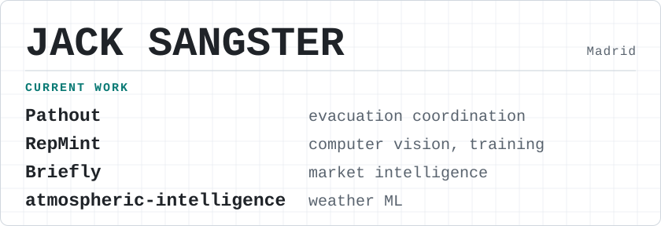

<picture>
  <source media="(prefers-color-scheme: dark)" srcset="assets/hero-dark.svg">
  <source media="(prefers-color-scheme: light)" srcset="assets/hero-light.svg">
  
</picture>

Building AI systems where scientific reasoning, quantitative analysis and real-world decisions intersect.

BSc Biochemistry, Imperial College London. Dual Master's (Management + Computer Science & Business Technology) at IE University, Madrid.

**[Systems](#systems)** · **[Toolkit](#toolkit)** · **[Background](#background)** · **[Contact](#contact)**

## Currently building

### Pathout `BUILDING`
Evacuation coordination and dynamic routing for complex buildings, starting with IE Tower in Madrid. Team build (private repositories) with a 3D simulation of the tower, a collective A* planner with hazard-aware replanning, and a manager/warden dashboard. I work on the dashboard.

Early stage: the dashboard replays a scripted incident (fire on floor 14, a stair compromised, an updated plan applied). It is not connected to a live building, and there are no pilots or measured results.

## Recognition

| | Result | Challenge | Project |
|---|---|---|---|
| 🥇 | **1st** | IE × Amazon Shipping Industry Challenge 2026 (240+ students) | Argo |
| 🥇 | **1st** | IE AI Module Demo Day 2026 (240+ students) | RepMint |
| 🥈 | **2nd** | AstraZeneca × IE Tech Impact Lab (130+ participants) | SEIL |
| 🥈 | **2nd** | IE Cursor AI Build Challenge (300+ competitors) | Sentinel |
| | Finalist | Google Developer Groups Tech Roulette | [Arcadia](https://github.com/jacksangster03/ArcadiaTechRoulette) |
| | Finalist | Accenture GenAI Mavericks | [MatchKey](https://github.com/jacksangster03/MatchKey-GenAI-Maverick) |

## Systems

### RepMint
Team project · private repository

AI camera coach for goal-based resistance training, running in the browser. MediaPipe 33-point pose estimation drives rep counting, form scoring, range of motion, tempo and time under tension. An AI plan generator builds programmes from a 115-exercise library.

### Sentinel
Team project · [source](https://github.com/simplyYK/sentinel) (teammate's repository)

Geospatial crisis navigation for civilians in conflict zones. 3D globe with three live data layers (ACLED, OpenSky, USGS), an AI crisis assistant and crowdsourced hazard reporting.

### Argo
Team project · private repository

AI deal desk for Amazon Shipping business development. Ingests RFQs, CRM notes, emails and spreadsheets, then applies a deterministic serviceability engine and a deterministic pricing engine (three margin scenarios). A logistic win-probability model is trained on 360 historical deals. Generates a branded PPTX proposal.

### SEIL
Team project · private repository

Governed RAG platform for AstraZeneca Spain's oncology HCP engagement. Seven compliance pathways route requests, with compliance-aware design and demand intelligence generation.

### Briefly
Solo project · [source](https://github.com/jacksangster03/Briefly)

Local-first portfolio intelligence platform. Six weekday briefing sessions delivered by Telegram and HTML email, built on a rule-based market stack (numbers are deterministic, not LLM-generated) with portfolio-aware relevance scoring. Breaking alerts use cooldowns and a flood cap. FastAPI and HTMX control centre, SQLite, APScheduler. Includes a portfolio workbench with risk analytics and Brinson-Hood-Beebower attribution. Over 1,600 test functions. Data sources include FRED, SEC EDGAR, Finnhub, GDELT, NewsAPI and yfinance.

## Scientific ML

- **atmospheric-intelligence** (private repository). ML post-processing of ECMWF IFS, ECMWF AIFS and ICON-EU forecasts for Madrid. Custom meteorological features, walk-forward validation, LightGBM bias correction, SHAP explanations. FastAPI and Next.js, 259 unit tests.
- **SMILES ↔ IUPAC** ([source](https://github.com/jacksangster03/smiles-iupac)). Seq2seq transformer for bidirectional molecular name translation, trained on 500K+ PubChem pairs with custom tokenisation.

## Toolkit

| | |
|---|---|
| **ML** | Python · PyTorch · scikit-learn · LightGBM · SHAP · MediaPipe |
| **Engineering** | TypeScript · Next.js · React · FastAPI · Supabase · PostgreSQL · Docker |
| **Scientific** | RDKit · bioinformatics · structural biology · scientific computing |
| **Quantitative** | time series · Monte Carlo · DCF / DDM · portfolio analysis |

## Background

Experience, education and languages

**Experience**
- Equity Research Analyst, Queen's Tower Capital: DCF/DDM modelling, risk evaluation, stock pitches
- Investment Analyst, Stockhub: comparable company analysis, published equity research
- Consulting Associate, Varvara Fashion: AI product strategy, market research, business model development
- Head of Corporate Relations & Education, Imperial College Finance Society: 1,000+ member community
- Sea turtle conservation fieldwork, Archelon Greece: nesting data, field operations, raised €18,000

**Education**
- Dual Master's, Management + Computer Science & Business Technology, IE University, Madrid, 2025-2027 (Finance & Investments · GSK × IE Biopharma & AI Gateway · Management Xponential Technology · Tech Impact Lab with AstraZeneca Spain)
- BSc Biochemistry, Imperial College London, 2022-2025

**Human languages:** English (native) · Spanish (native) · German (advanced) · Russian (intermediate) · French (intermediate)

## Contact

[Portfolio](https://jacksangster03.github.io) · [Email](mailto:jacksangster.033@gmail.com) · [LinkedIn](https://www.linkedin.com/in/jacksangster/) · [GitHub](https://github.com/jacksangster03)
